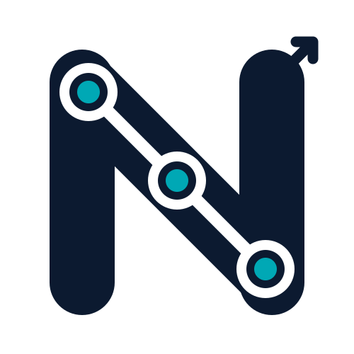

<p align="center">
  
</p>

<h1 align="center">NixRoute</h1>
<p align="center"><strong>ESP32 API Gateway</strong> — a standalone OpenAI-compatible AI gateway that runs entirely on an ESP32.</p>

---

> Point any OpenAI SDK at `http://<esp32-ip>/v1` and it routes your requests across
> one or more AI providers — with automatic failover, round-robin load balancing,
> token usage tracking, and a dashboard to manage it all from your browser.

```
curl / Python OpenAI SDK / Claude Code / OpenCode
        │
        │  OpenAI-compatible HTTP (LAN, plain :80)
        ▼
   ESP32-WROOM-32  ──  Arduino WebServer + TLS (mbedTLS) upstream
        │
        └─► N dynamic providers (OpenAI / OpenRouter / Groq / DeepSeek / Ollama / …)
              · streaming (SSE) and non-streaming proxying
              · automatic failover and round-robin
              · token usage + per-provider metrics
```

---

## Why it exists

NixRoute turns a $5 dev board into a tiny self-hosted gateway that sits between
your AI tools and the providers you already pay for. All configuration lives on
the device (NVS), the dashboard is served straight from flash, and nothing is
hardcoded in the firmware. It is deliberately LAN-only and plain-HTTP — a private
onion you expose over a VPN, not the open internet.

---

## Features

- **OpenAI-compatible** — `POST /v1/chat/completions` and `GET /v1/models` speak the
  standard shapes, so existing SDKs and tools work without wrappers.
- **Streaming & non-streaming** — `stream: true` responses are relayed as real SSE
  with correct chunked framing (no full-body buffering in RAM).
- **Multi-provider routing** — up to 16 providers, each with a name, base URL, and
  key. Model lists are fetched automatically and cached in NVS.
- **Smart failover** — a request cascades to the next candidate when a provider is
  unreachable or fails; the circuit breaker parks a repeatedly-failing provider in
  a short cooldown instead of hammering it.
- **Round-robin** — when several providers serve the same model id, traffic is
  rotated across them to spread quota and rate limits.
- **Namespaced models** — models are exposed as `nx/<provider>/<model>` (for example
  `nx/geraikita/claude-opus-5`), so routing is always unambiguous.
- **Token usage tracking** — prompt / completion / total tokens per request, a
  per-model breakdown, and a rolling log of recent calls. Understands both OpenAI
  (`prompt_tokens`…) and Anthropic-style (`input_tokens`…) usage objects.
- **Per-provider metrics** — requests, success, failures, `429`s, and last latency
  for every provider.
- **Glassmorphism dashboard** — a clean, responsive single-page dashboard with no
  external dependencies, served from flash and fully usable offline on your LAN.
  Liquid-glass dark theme by default, with a light mode toggle (remembered per
  browser).
- **Persistence** — providers, keys, Wi-Fi, API tokens, and the admin password live
  in NVS via `Preferences`.
- **Auth** — optional Bearer tokens for `/v1/*` and a random per-boot session cookie
  for the admin area (no more forgeable static cookie).
- **No secrets in code** — Wi-Fi and provider keys are set from the dashboard.

---

## Requirements

| Item | Detail |
|---|---|
| Board | DOIT ESP32 DEVKIT V1 (ESP32-WROOM-32, 4 MB flash) |
| Core | ESP32 Arduino core 3.3.x |
| Toolchain | Arduino CLI or Arduino IDE 2.x |
| Library | `ArduinoJson` (7.x); everything else ships with the ESP32 core |

---

## Repository layout

```
firmware_arduino/esp32_router/
  esp32_router.ino    # firmware: HTTP server, routing, failover, NVS, Wi-Fi, tasks
  dashboard_html.h    # dashboard SPA (HTML/CSS/JS, compiled into flash)
assets/
  nixroute.svg        # brand logo
  screenshots/        # dashboard screenshots
tests/scripts/        # host-side HTTP smoke tests (no hardware needed)
```

---

## Build & flash

### Prerequisites

1. Install [Arduino CLI](https://arduino.github.io/arduino-cli/) (or use the Arduino IDE).
2. Add the ESP32 board package:

   ```bash
   arduino-cli config init
   arduino-cli config add board_manager.additional_urls https://raw.githubusercontent.com/espressif/arduino-esp32/gh-pages/package_esp32_index.json
   arduino-cli core update-index
   arduino-cli core install esp32:esp32
   ```

3. Install `ArduinoJson`:

   ```bash
   arduino-cli lib install ArduinoJson
   ```

### Compile & upload

Find your port with `arduino-cli board list` (e.g. `COM11` on Windows), then:

```bash
# board: DOIT ESP32 DEVKIT V1 → FQBN esp32:esp32:esp32
arduino-cli compile --fqbn esp32:esp32:esp32 firmware_arduino/esp32_router
arduino-cli upload  --fqbn esp32:esp32:esp32 --port COM11 firmware_arduino/esp32_router
arduino-cli monitor --port COM11 --config baudrate=115200
```

Typical size (ESP32 core 3.3.11, default 4 MB flash):

```
Sketch uses 1198236 bytes (91%) of program storage space.
Global variables use 56936 bytes (17%), leaving 270744 bytes.
```

The sketch fits the default partition layout. If you ever grow it past that,
compile with the Huge APP partition scheme
(`--fqbn esp32:esp32:esp32:PartitionScheme=huge_app`) — note that changing the
partition table erases existing NVS settings.

### Using the Arduino IDE

1. Install the **esp32** board package (*Tools → Board → Boards Manager*, additional
   URL `https://raw.githubusercontent.com/espressif/arduino-esp32/gh-pages/package_esp32_index.json`).
2. Install **ArduinoJson** (*Tools → Manage Libraries*).
3. Open `firmware_arduino/esp32_router/esp32_router.ino`.
4. *Tools → Board → esp32 → ESP32 Dev Module*, pick your port, **Upload**, then open
   the Serial Monitor at `115200` baud.

### First boot / Wi-Fi

On first boot there is no Wi-Fi configured, so NixRoute opens an access point
**`NixRoute-Setup`** (password `12345678`, IP `192.168.4.1`). Connect to it, open
`http://192.168.4.1/`, sign in with the default admin password `123456`, and set
your Wi-Fi from *Settings*. The device reboots into station mode and prints its IP
on the serial monitor.

---

## Dashboard

Open `http://<esp32-ip>/` and sign in (default password `123456`).

| View | Purpose |
|---|---|
| **Overview** | Device status, your endpoint + the API token in use, provider health, then the client-setup snippets at the bottom |
| **Usage** | Token totals, per-model breakdown, live recent requests |
| **Playground** | Try a streaming prompt against any active provider |
| **Providers** | Add / edit / delete providers, toggle active, ping, sync models |
| **Settings** | Local API tokens, Wi-Fi, admin password |

### Providers

Add a provider with a **name**, **base URL**, and **API key**. The URL may be
`https://` or plain `http://`. On save the firmware calls the provider's
`GET /v1/models` and caches the result, exposing each model as
`nx/<provider-id>/<model>`. The provider id is derived from the name; if two names
would slug to the same id the API returns `409` instead of silently overwriting.
To **edit** an existing provider the request must carry its `id` (the dashboard does
this automatically) — leave the key blank to keep the stored one. Use the **active**
toggle to disable a provider without deleting it, and **Ping / Sync** to test
connectivity and refresh the model cache.

Auth uses a random per-boot session cookie (`esp_auth`, `HttpOnly`, 24 h). Log out
from the top-right button.

---

## API

### Public (OpenAI-compatible)

| Method | Path | Auth | Description |
|---|---|---|---|
| `GET` | `/health` | none | device + connection + token totals + per-provider metrics |
| `GET` | `/v1/models` | Bearer if tokens set | OpenAI `list`; ids as `nx/<provider>/<model>` |
| `POST` | `/v1/chat/completions` | Bearer if tokens set | proxy with failover + round-robin; streaming supported |

`/v1/chat/completions` is single-flight on the device: while one request is being
relayed, a second one gets `503 {"error":{"message":"proxy busy, try again"}}`.

### Admin (JSON, session-cookie-authenticated)

| Method | Path | Body | Description |
|---|---|---|---|
| `GET` | `/api/state` | — | full state: providers, metrics, usage, tokens, Wi-Fi, stats |
| `GET` | `/admin/status` | — | same as `/health` but requires an admin session |
| `POST` | `/api/providers` | `{id?,name,url,key,active}` | add provider, or edit when `id` given; auto-fetches models |
| `POST` | `/api/providers/remove` | `{id}` | delete a provider (and its model cache) |
| `POST` | `/api/providers/toggle` | `{id,active}` | enable / disable |
| `POST` | `/api/providers/fetch` | `{id}` | refresh + cache the provider model list |
| `POST` | `/api/providers/ping` | `{id}` | measure latency + HTTP status of a provider |
| `POST` | `/api/token/generate` | — | create a client token (up to 5) |
| `POST` | `/api/token/delete` | `{token}` | revoke one token |
| `POST` | `/api/token/clear` | — | revoke all client tokens |
| `POST` | `/api/password` | `{password}` | change the admin password |
| `POST` | `/api/wifi` | `{ssid,pass}` | save Wi-Fi and reboot |
| `POST` | `/api/reboot` | — | reboot the device |

Responses carry `Access-Control-Allow-Origin: *` and `Cache-Control: no-store`.
Errors are OpenAI-shaped: `{"error":{"message":"…"}}`.

> **CSRF note:** state-changing admin calls (`POST`) must include the header
> `X-NixRoute: 1`. The dashboard sends it automatically; a cross-site form
> cannot. Plain `GET` reads (e.g. `/api/state`) are cookie-only.

### Examples

```bash
curl http://<ip>/health

curl -H "Authorization: Bearer $TOKEN" http://<ip>/v1/models

curl -H "Authorization: Bearer $TOKEN" http://<ip>/v1/chat/completions \
  -H "Content-Type: application/json" \
  -d '{"model":"nx/geraikita/claude-opus-5","messages":[{"role":"user","content":"hi"}]}'

# OpenAI SDK
OPENAI_BASE_URL=http://<ip>/v1 OPENAI_API_KEY=$TOKEN python - <<'EOF'
from openai import OpenAI
c = OpenAI()
r = c.chat.completions.create(model="nx/geraikita/claude-opus-5",
                              messages=[{"role": "user", "content": "hi"}])
print(r.choices[0].message.content)
EOF
```

---

## Security notes

- **LAN-only, plain HTTP** — don't port-forward it. Reach it remotely over a VPN
  (WireGuard/Tailscale) instead.
- Provider keys live in NVS and are never returned in full by any endpoint (masked).
- When at least one local token exists, every `/v1/*` call needs
  `Authorization: Bearer <token>` (compared in constant time).
- The admin area uses a random per-boot session cookie, and the admin password is
  never printed to the serial log.
- Flash encryption is not enabled; a device in someone's hands can be read. Treat
  the board like a physical key.

---

## Testing

Host-side smoke tests (no hardware changes needed; pass your board's IP):

```bash
python tests/scripts/test_health.py --host 192.168.110.187
python tests/scripts/test_openai_compat.py --host 192.168.110.187 --model nx/geraikita/claude-opus-5 --token "$TOKEN" --stream
python tests/scripts/test_admin_api.py --host 192.168.110.187 --password 123456
```

---

## Known limitations

- One chat request at a time (single-flight) — by design, to keep the proxy and the
  dashboard responsive on a small MCU; overlapping requests get `503`.
- The WebServer task and the proxy task share the client socket while a response
  streams. It works, but a client that drops mid-stream is detected via write
  failures (`delivered=0` in the serial log) rather than being handled instantly.
- Unbuffered non-streaming replies are capped (~192 KB) so a runaway completion
  can't OOM the gateway.

---

## Contributing

Bug reports, feature requests, and pull requests are welcome — see
[`CONTRIBUTING.md`](CONTRIBUTING.md).

---

## License

MIT — see [`LICENSE`](LICENSE).
